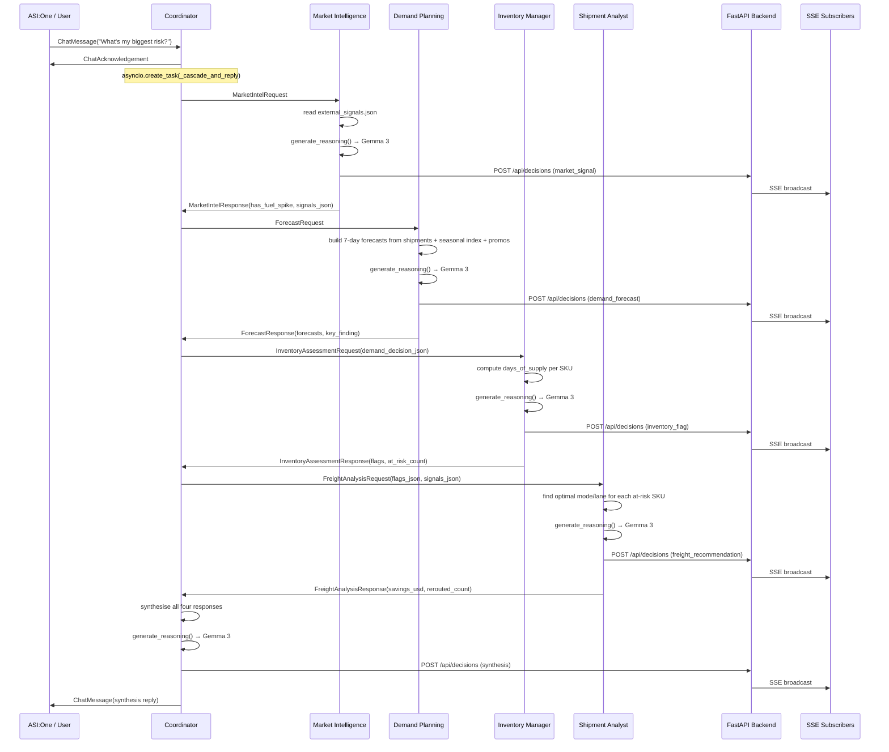

# SupplyMind — Technical Architecture

This document is for judges and contributors who want to understand the system in depth. The README covers setup and the demo scenario; this document covers design decisions, data flow, and the cascade sequence.

---

## System overview

SupplyMind solves a specific problem: perishable goods companies make replenishment decisions too slowly because the signals that should drive those decisions — demand spikes, freight cost changes, inventory positions — live in separate systems and require manual synthesis.

The architecture separates signal detection, domain analysis, and decision synthesis into five independent agents, each owning exactly one domain. The coordinator agent acts as a stateless router and synthesiser; it never holds business logic. Buyers interact through ASI:One (Agentverse) or the dashboard.

---

## Agent boundaries

```
┌─────────────────────────────────────────────────────────────────┐
│                        Coordinator                              │
│  • Receives ChatMessage from ASI:One via Agentverse mailbox     │
│  • Routes the cascade in order: MI → DP → IM → SA              │
│  • Synthesises all four responses into a single reply           │
│  • Posts a synthesis AgentDecision to the backend               │
│  • Never holds domain state or business logic                   │
└──────┬────────────┬────────────┬────────────┬───────────────────┘
       │            │            │            │
       ▼            ▼            ▼            ▼
  Market      Demand       Inventory    Shipment
  Intelligence Planning     Manager     Analyst
  ──────────  ────────     ─────────   ────────
  external_   historical_  inventory.  freight_
  signals.    shipments    json        rates.json
  json        seasonal_
              index
              promo_
              calendar
```

Each specialist agent:
1. Reads from its assigned data source(s) in `shared/mock_data/`
2. Runs deterministic computation (no LLM)
3. Calls `generate_reasoning()` for a 2-3 sentence qualitative summary
4. Posts an `AgentDecision` to `/api/decisions`
5. Returns a typed response to the coordinator

---

## Data contracts

`shared/contracts.py` is the single source of truth. `shared/contracts.ts` is kept in sync manually. **Neither file is ever edited without explicit team sign-off.**

### `AgentDecision` — every agent produces exactly this

```python
class AgentDecision(BaseModel):
    agent_name: str               # "market_intelligence" | "demand_planning" | ...
    decision_type: str            # "market_signal" | "demand_forecast" | ...
    summary: str                  # one sentence — displayed in dashboard cards
    reasoning: str                # 2-3 sentences from Gemma 3 — displayed in card body
    confidence: float             # 0.0–1.0
    inputs_considered: list[str]  # data sources used
    outputs: dict[str, Any]       # typed sub-objects (DemandForecast, InventoryFlag, ...)
    timestamp: datetime
    downstream_targets: list[str] # which agents to route to next
```

### Typed outputs (embedded in `AgentDecision.outputs`)

| Type | Produced by | Key fields |
|---|---|---|
| `DemandForecast` | Demand Planning | `units_per_day[7]`, `spike_detected`, `spike_magnitude_pct` |
| `InventoryFlag` | Inventory Manager | `flag_type` (at_risk/excess/ok), `days_of_supply`, `urgency` |
| `FreightRecommendation` | Shipment Analyst | `savings_usd`, `original_mode`, `recommended_mode` |

---

## Cascade sequence diagram



---

## LLM usage policy

Gemma 3 (via Ollama) is used **only for qualitative reasoning** — the `reasoning` field of each `AgentDecision`. All deterministic computation (days-of-supply, reorder quantities, cost savings, spike ratios) is done in Python with no LLM involvement.

```python
# Good — LLM for qualitative narrative
reasoning = generate_reasoning(
    "You are a logistics analyst. Write a 2-3 sentence reasoning for "
    f"switching {REROUTED_SHIPMENTS} shipments to intermodal, saving ${savings:,.0f}."
)

# Bad — never do arithmetic in the LLM
result = generate_reasoning("What is 3540 - 1829.56?")  # just use Python
```

This keeps reasoning latency bounded (one Gemma 3 call per agent, ~5-15 s on the GX10 NPU), outputs deterministic for the business logic, and the LLM output replaceable without changing any downstream code.

---

## SSE stream design

The backend maintains two in-memory structures:

```python
_decisions: list[AgentDecision]        # replay buffer for new subscribers
_subscribers: list[asyncio.Queue]      # one queue per open SSE connection
```

On connect, `/api/stream` replays all stored decisions immediately, then parks on the queue. On each `POST /api/decisions`, `_broadcast()` puts the payload into every queue simultaneously. No Redis, no pub/sub — adequate for a single-node demo deployment.

The dashboard SSE client deduplicates by `agent_name:timestamp` key so reconnects don't show duplicate cards.

---

## Coordinator re-delivery protection

The coordinator uses `mailbox=True`, which means uAgents polls the Agentverse inbox. The cascade involves four sequential Ollama calls (5-15 s each, ~60 s total). Without protection, the mailbox re-delivers the same message while the cascade is in-flight, triggering duplicate runs.

Fix (in `agents/coordinator/agent.py`):

```python
_processing: set[str] = set()

@chat_proto.on_message(ChatMessage)
async def handle_chat_message(ctx, sender, msg):
    # 1. Send ack immediately — marks message processed in mailbox
    await ctx.send(sender, ChatAcknowledgement(...))

    # 2. Deduplicate by msg_id
    if str(msg.msg_id) in _processing:
        return
    _processing.add(str(msg.msg_id))

    # 3. Background task — handler returns instantly
    asyncio.create_task(_cascade_and_reply(ctx, sender, ...))
```

---

## Demo mode

`POST /api/trigger/demo` runs the same cascade structure but replaces Ollama calls with hardcoded, polished reasoning strings and inserts `asyncio.sleep(3)` between each agent broadcast. This gives:

- **Identical output** across all rehearsal runs (no Ollama variability)
- **Controlled pacing** — each agent card appears exactly 3 seconds after the previous
- **No LLM dependency** — works even if Ollama isn't loaded yet

The frontend reads `isDemoMode` from `DemoContext` and routes "Run Demo" to `/api/trigger/demo` vs `/api/trigger/cascade` accordingly. On each incoming SSE decision, `window.speechSynthesis.speak(decision.summary)` narrates the one-sentence summary.

---

## Frontend architecture

```
app/
  layout.tsx           → DemoProvider wraps everything; DemoToggle in header
  page.tsx             → Overview: fetches /api/decisions + /api/replenishment-plan
  activity/page.tsx    → SSE feed; Run Demo routes to /cascade or /demo
  plan/page.tsx        → fetches /api/replenishment-plan; purchase order table
  demo/script/page.tsx → fixed full-screen overlay; timer; beat-synced notes

components/
  DecisionCard.tsx     → renders one AgentDecision; confidence badge; cross-ref chips
  SavingsCounter.tsx   → requestAnimationFrame, ease-out cubic, $0 → target over 1.5 s
  DemoToggle.tsx       → header pill; reads/writes DemoContext
  NavLinks.tsx         → active-state nav

contexts/
  DemoContext.tsx      → isDemoMode persisted to localStorage; toggleable from any page
```

The dashboard is entirely static-rendered except for the SSE connection. No authentication, no server actions — all state flows through the SSE stream and REST endpoints.

---

## Mock data

All data is generated by `shared/generate_mock_data.py` and committed to `shared/mock_data/`. The demo scenario is anchored to **Monday, Week 47 (2024-11-18)** so all time-relative computations are deterministic.

| File | Contents | Key demo fixture |
|------|----------|-----------------|
| `skus.json` | 12 SKUs with safety stock, reorder points | SKU-4471 (Holiday Mixed Nuts) — the hero SKU |
| `historical_shipments.json` | 90 days of daily shipments per SKU | SKU-4471 baseline ~150 units/day, recent ~510 |
| `seasonal_index.json` | Weekly seasonal multipliers | Week 47 index: 2.40 (Thanksgiving peak) |
| `promo_calendar.json` | Active promotions by week | SKU-4471 Thanksgiving promo: +120% demand lift |
| `inventory.json` | Current lots: on-hand, in-transit, WIP | SKU-4471: 1,071 on-hand → 2.1 days at spike rate |
| `freight_rates.json` | Lane × mode rate matrix | Truck $3,540, intermodal $1,830 → $3,421 total savings |
| `external_signals.json` | Market events (mock feed) | fuel_surcharge_spike +18% on Gulf Coast lane |
| `production.json` | Vendor × SKU production records | Vendor mapping for replenishment POs |

---

## Deployment

```yaml
# docker-compose.yml highlights
services:
  backend:
    extra_hosts: ["host.docker.internal:host-gateway"]  # reach Ollama on Linux host
    environment:
      LLM_BASE_URL: http://host.docker.internal:11434

  agents:
    extra_hosts: ["host.docker.internal:host-gateway"]
    command: python -m agents.run  # supervisor starts all 5 as subprocesses
```

The `agents.run` supervisor starts all five agents as separate subprocesses and implements fail-fast: if any agent exits unexpectedly, the supervisor terminates the group so Docker restarts the container cleanly.

Memory targets: coordinator 512 MB, each specialist 256 MB, backend 512 MB, dashboard 256 MB. Total: ~2 GB RAM, leaving headroom on the GX10 for Gemma 3 in NPU memory.
